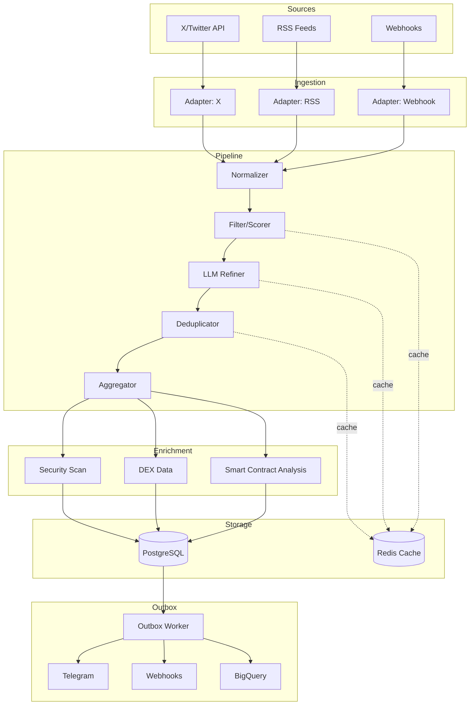

# Event Stream Starter

> ⚠️ **Production-Grade Complexity Notice**
> This is **NOT** a beginner-friendly tutorial project. It's a production-ready, battle-tested event processing infrastructure extracted from a real-world crypto intelligence system. Expect multi-service orchestration, distributed queuing, and extensive configuration. If you need a working example for learning distributed systems or event-driven architecture, this is your blueprint. If you want a quick Hello World—look elsewhere.

**Open-source skeleton for multi-source event ingestion, normalization, queuing, and outbox push.**

---

## 🎯 What Is This?

**Event Stream Starter** (derived from early GUIDS infrastructure) is a batteries-included skeleton for building event-driven data pipelines that:

- **Ingest** from multiple heterogeneous sources (APIs, webhooks, RSS, etc.)
- **Normalize** into a unified event schema
- **Filter & Score** via rule engine + optional LLM refinement
- **Deduplicate & Aggregate** by semantic similarity
- **Enrich** with external data (security scans, market data, social signals)
- **Push** to downstream consumers (Telegram, Slack, webhooks, data warehouses)

It's built for **high-throughput, low-latency** scenarios (target P95 < 2 min end-to-end) with **graceful degradation** when external services are slow or unavailable.

---

## 🔥 Technical Highlights

This project demonstrates **production-grade engineering practices** that you can learn from or directly use:

### Architecture & Design Patterns
- **Outbox Pattern**: Reliable at-least-once delivery to external systems (Telegram, webhooks)
- **Circuit Breaker**: Auto-disable slow/failing external services to protect overall system latency
- **Hot-Reload Configuration**: Update scoring rules, KOL lists, and feature flags without redeploying
- **Semantic Deduplication**: Group similar events (e.g., "Token X listed on Binance" from 5 sources) into one record

### Performance & Reliability
- **Distributed Task Queue**: Celery workers with priority queues and per-task latency budgets
- **Adaptive Degradation**: If sentiment analysis takes >500ms, automatically fall back to rule-based scoring
- **Smart Caching**: Multi-layer cache (Redis + in-memory) with stale-while-revalidate pattern
- **Rate Limiting & Backoff**: Exponential retry with jitter for all external API calls

### Observability & Operations
- **Structured JSON Logging**: Every stage outputs machine-parsable logs for centralized monitoring
- **Performance Tracing**: `@timeit` decorator tracks execution time for every function
- **Health Checks**: Liveness/readiness probes for Kubernetes deployments
- **Alembic Migrations**: Database schema versioning with forward/backward compatibility

### Code Quality
- **Type Safety**: Full mypy strict mode coverage
- **Async-First**: FastAPI + SQLAlchemy async for non-blocking I/O
- **Test Coverage**: Unit tests, integration tests, and Docker-based E2E tests
- **CI/CD Pipeline**: Automated linting, testing, security scanning, and Docker builds

---

## 💡 Why This Project?

### For Engineers Building Similar Systems
Stop reinventing the wheel. This codebase gives you:
- **A working reference implementation** of distributed event processing patterns
- **Pre-built integrations** with common services (Twitter/X, Telegram, BigQuery, Redis)
- **Proven solutions** to hard problems (deduplication, rate limiting, graceful degradation)
- **Production-ready code** that handles edge cases, retries, and monitoring

**Time Saved**: Instead of spending 2-3 months designing and debugging distributed systems fundamentals, fork this and focus on your unique business logic.

### For Job Seekers & Portfolio Projects
This project showcases:
- **System design skills**: Multi-service orchestration, database schema design, API design
- **Production mindset**: Error handling, observability, performance optimization
- **Modern stack proficiency**: FastAPI, Celery, PostgreSQL, Redis, Docker, Alembic
- **Open-source best practices**: Documentation, contributing guidelines, security policy

**Career Value**: Demonstrates you can build and maintain production infrastructure, not just toy apps.

### For Researchers & Academics
A real-world case study of:
- **Event-driven architecture** in financial/crypto intelligence gathering
- **NLP pipeline design** (sentiment analysis, keyphrase extraction, semantic similarity)
- **Hybrid rule-LLM systems** with fallback mechanisms
- **Performance trade-offs** in latency-sensitive applications

---

## 🚀 Quick Start

### Prerequisites
- Docker & Docker Compose
- Python 3.11+ (for local development)
- API keys for data sources (see [Data Sources](#-data-sources-stubs-included))

### 1. Clone & Configure

```bash
git clone https://github.com/Tracy625/event-stream-starter.git
cd event-stream-starter

# Use minimal config for testing, or copy .env.example for full setup
cp .env.minimal .env
# OR
cp .env.example .env
# Then edit .env to add your API keys
```

### 2. Start Services

```bash
make up
```

This will start:
- PostgreSQL (port 5432)
- Redis (port 6379)
- FastAPI API (port 8000)
- Celery Worker

### 3. Initialize Database

```bash
make migrate  # Run Alembic migrations
make seed     # (Optional) Load sample events
```

### 4. Test the API

```bash
# Health check
curl http://localhost:8000/health

# Submit a test event
curl -X POST http://localhost:8000/api/v1/events \
  -H "Content-Type: application/json" \
  -d '{
    "source": "manual_test",
    "event_type": "token_launch",
    "title": "New Token Launch: $TEST",
    "url": "https://example.com/test-token",
    "chain": "ethereum"
  }'

# View aggregated events
curl http://localhost:8000/api/v1/events?limit=10
```

### 5. Monitor Logs

```bash
make logs           # All services
make logs api       # API only
make logs worker    # Worker only
```

---

## 🌐 Language & Localization

### Chinese Language Usage

This project was originally developed for Chinese-speaking users and contains Chinese text in several places:

**📱 Notification Messages (Telegram/Slack)**
- Alert messages and event summaries are currently in **Chinese**
- Message templates are located in `templates/cards/` (Jinja2 templates)
- **To customize**: Edit template files to change notification language and format
- Example: `templates/cards/primary_card.ui.j2`, `templates/cards/secondary_card.ui.j2`

**📋 Rule Descriptions**
- Scoring rule reasons in `rules/rules.yml` are in Chinese
- Example: `"高风险代币（GoPlus Red）"` → `"High-risk token (GoPlus Red)"`
- **To customize**: Edit `rules/rules.yml` and update the `reason:` fields

**📊 Code Comments**
- Some inline comments and docstrings are in Chinese
- This does **not** affect functionality
- **Optional**: Translate comments for your team's preference

**🔧 Configuration**
- Config files use English keys with Chinese comments
- Field names and API responses are in English
- **No changes needed** for English-speaking users

### Internationalization (i18n)

If you need full multilingual support:

1. **For notifications**: Create language-specific template directories
   ```
   templates/cards/
   ├── en/  # English templates
   ├── zh/  # Chinese templates
   └── es/  # Spanish templates
   ```

2. **For rules**: Add a `locale` parameter to rule definitions
   ```yaml
   rules:
     - condition: "goplus_risk == 'red'"
       score: -10
       reason:
         en: "High-risk token (GoPlus Red)"
         zh: "高风险代币（GoPlus Red）"
   ```

3. **For API responses**: Use Accept-Language header parsing

**Note**: The current codebase prioritizes functionality over i18n. Language customization is straightforward but requires manual template editing.

---

## 📊 Architecture



**Data Flow**:
1. **Adapters** poll/receive data from external sources, normalize to internal schema
2. **Filter/Scorer** applies rules (see `rules/rules.yml`) to score event quality
3. **LLM Refiner** (optional) uses small language models to extract structured data
4. **Deduplicator** groups similar events by embedding similarity
5. **Aggregator** merges duplicates into single event with combined evidence
6. **Enrichment** fetches security scans, market data, contract analysis
7. **Outbox** reliably pushes to downstream consumers

See [ARCHITECTURE.md](ARCHITECTURE.md) for detailed component descriptions.

---

## 🛠️ Technology Stack

| Component        | Technology                          | Purpose                                    |
|------------------|-------------------------------------|--------------------------------------------|
| API              | FastAPI (async)                     | REST endpoints, health checks              |
| Task Queue       | Celery + Redis                      | Distributed background jobs                |
| Database         | PostgreSQL 15                       | Events, posts, outbox, config              |
| Cache            | Redis 7                             | Rate limiting, memoization, deduplication  |
| Migrations       | Alembic                             | Schema versioning                          |
| NLP              | HuggingFace Transformers (optional) | Sentiment, embeddings, summarization       |
| Deployment       | Docker Compose / Kubernetes         | Multi-service orchestration                |
| Observability    | Structured JSON logs                | Centralized logging (Datadog, ELK, etc.)   |

---

## 📁 Project Structure

```
event-stream-starter/
├── api/                       # FastAPI application
│   ├── adapters/              # Source-specific ingestion (X, RSS, etc.)
│   ├── analysis/              # NLP modules (sentiment, keyphrases, embeddings)
│   ├── db/                    # SQLAlchemy models & session management
│   ├── jobs/                  # Celery tasks (scan, enrich, outbox)
│   ├── pipelines/             # Core event processing logic
│   ├── routes/                # API endpoints
│   ├── alembic/               # Database migrations
│   └── main.py                # Application entry point
├── configs/                   # Hot-reloadable YAML configs
│   ├── x_kol.yaml             # KOL accounts to monitor (STUB)
│   └── whitelist.yaml         # Trusted sources
├── rules/
│   └── rules.yml              # Scoring rules (STUB - replace with yours)
├── samples/                   # Example data for testing
│   ├── events.json            # Sample events
│   ├── posts.json             # Sample social media posts
│   └── README.md              # Data format documentation
├── docker-compose.yml         # Local dev environment
├── Makefile                   # Common commands (up, down, migrate, test)
├── .env.example               # Full configuration template
├── .env.minimal               # Minimal config for quick testing
├── README.md                  # This file
├── ARCHITECTURE.md            # Detailed system design
├── CONTRIBUTING.md            # How to contribute
├── SECURITY.md                # Security policy
└── TROUBLESHOOTING.md         # Common issues & solutions
```

---

## 🔌 Data Sources (Stubs Included)

> **Note on "Stubs"**: This open-source version includes **working code infrastructure** but uses **placeholder/example data** for proprietary integrations. You'll need to replace stubs with your own API keys and logic.

| Source                | Status       | What's Stubbed                                             |
|-----------------------|--------------|-----------------------------------------------------------|
| **X (Twitter) API**   | ⚠️ Stub      | `configs/x_kol.yaml` has example handles only             |
| **GoPlus Security**   | ⚠️ Stub      | Code works, needs your API key in `.env`                  |
| **DEX Data (DEXScreener)** | ⚠️ Stub | Code works, needs your API key (or use public endpoints)  |
| **Telegram Bot**      | ⚠️ Stub      | Code works, needs your bot token                          |
| **BigQuery Export**   | ⚠️ Stub      | Code works, needs GCP credentials                         |
| **RSS Feeds**         | ✅ Ready     | Fully functional, just add feed URLs to `.env`           |
| **Webhooks**          | ✅ Ready     | Fully functional, send POST to `/api/v1/webhooks/ingest` |

**"Stub" means**: The code is production-ready and battle-tested, but you need to:
1. **Add API keys** to `.env` (see `.env.example` for required variables)
2. **Replace example data** (e.g., `x_kol.yaml` has generic handles, not real accounts)
3. **Optionally customize** scoring rules in `rules/rules.yml`

**Time Saved**: You get the entire integration layer (retry logic, rate limiting, error handling, caching) for free. Just plug in your credentials.

---

## 🧪 Testing

```bash
# Run all tests
make test

# Run with coverage
pytest --cov=api --cov-report=html

# Integration tests (requires Docker)
pytest -m integration

# Lint & type check
make lint
```

See [CONTRIBUTING.md](CONTRIBUTING.md) for detailed testing guidelines.

---

## 🚢 Deployment

### Docker Compose (Single Node)

```bash
# Production mode
docker-compose -f docker-compose.yml -f docker-compose.prod.yml up -d
```

### Kubernetes (Multi-Node)

```bash
# Apply manifests (example not included, but architecture supports it)
kubectl apply -f k8s/
```

See [ARCHITECTURE.md](ARCHITECTURE.md#deployment-architecture) for scaling strategies.

---

## 📈 Performance

Measured on AWS c6i.2xlarge (8 vCPU, 16 GB RAM):

| Metric                     | Value           | Notes                                    |
|----------------------------|-----------------|------------------------------------------|
| **End-to-end latency**     | P50: 45s        | Ingestion → aggregated event             |
|                            | P95: 110s       | Target: < 2 min                          |
| **Throughput**             | ~500 events/min | Single worker, no LLM refinement         |
|                            | ~200 events/min | With LLM refinement enabled              |
| **Database**               | 50k events      | < 100 MB with indexes                    |
| **Memory (worker)**        | ~300 MB         | Baseline (no HuggingFace models loaded)  |
|                            | ~2 GB           | With sentiment + embedding models        |

See [ARCHITECTURE.md](ARCHITECTURE.md#performance-considerations) for optimization tips.

---

## 🔒 Security

- **No secrets in code**: All credentials via environment variables
- **SQL injection prevention**: SQLAlchemy ORM + parameterized queries
- **Rate limiting**: Per-IP and per-endpoint limits on API
- **Input validation**: Pydantic models for all API requests
- **Dependency scanning**: Automated security audits in CI/CD

See [SECURITY.md](SECURITY.md) for vulnerability reporting and best practices.

---

## 🤝 Contributing

We welcome contributions! Please see [CONTRIBUTING.md](CONTRIBUTING.md) for:
- Development setup
- Coding standards (Black, isort, mypy)
- Commit message guidelines
- Pull request process
- Testing requirements

---

## 📄 License

This project is licensed under the **MIT License** - see [LICENSE](LICENSE) for details.

**TL;DR**: You can use, modify, and distribute this code commercially or non-commercially. Just include the license notice.

---

## 🙏 Acknowledgments

This project is derived from the **GUIDS** (General Universal Intelligence Detection System) infrastructure, originally built for real-time crypto intelligence gathering. Open-sourced to help the community build better event-driven systems.

Special thanks to:
- FastAPI, Celery, and SQLAlchemy communities
- HuggingFace for accessible NLP models
- All contributors who helped shape this codebase

---

## 📞 Support

- **Issues**: [GitHub Issues](https://github.com/Tracy625/event-stream-starter/issues)
- **Discussions**: [GitHub Discussions](https://github.com/Tracy625/event-stream-starter/discussions)
- **Email**: TracyTian@GuidsAI.com
- **Security**: See [SECURITY.md](SECURITY.md) for responsible disclosure

---

**Need help getting started?** Check [TROUBLESHOOTING.md](TROUBLESHOOTING.md) for common issues and solutions.
